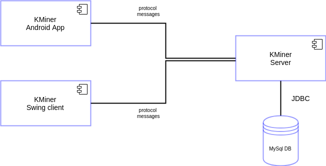
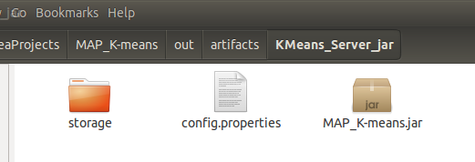

Acronimi utilizzati in questo documento:
* HCD: Human Centered Design

# K-Miner Server

## Architettura
L'architettura del server si articola nelle seguenti componenti:

* Server Core: componente principale per l'accesso e il mining dei dati ( *data, database, mining packages*) ed implementazione multithreading per la gestione non bloccante di client multipli.
* Protocol: componente per la comunicazione message-based client-server
* Services: componente per la dichiarazione ed esecuzione dei servizi richiesti al server
* Server Logger: componente per il logging delle connessioni.

* Server Configuration: componente per la gestione della configurazione del server.

Il server core è il risultato delle varie esercitazioni tenutesi in laboratorio, le altre componenti (*da non ritenersi come estensioni del progetto*) implementano design patterns e best practice per un implementazione del sistema **solida** ed **estendibile**.

Dove possibile, si è scelto di usare uno stile dichiarativo attraverso l'utlizzo di file .xml (es. services.xml) ed evitare qualsiasi "hardcoded value".

### KMiner ecosystem
Nel seguente diagramma vengono mostrate le principali componenti e come esse interagiscono tra loro.

## Deploy guide
Il deployment del server avviene attraverso il file jar (specificare quale), Per l'esecuzione del jar è possibile:

* Eseguire il comando `java -jar <nome jar>`
* Eseguire gli script `server_run.sh` (MacOs/Linux) o `server_run.`(inserire nome script Window)

Il server mette a disposizione un meccanismo di configurazione per facilitare le operazioni di deployment.
Nello specifico, nel file jar risiede il file _config.properties_ dove sono dichiarate le impostazioni per la configurazione di default. Per adattare il server all'ambiente di deployment, può essere effettuato l'overriding del file _config.properties_ fornendo un file con lo stesso nome nella **working directory** del file jar:

In questo modo il server provvederà nella fase di avvio a caricare prima il "file custom" (se presente), altrimenti caricherà il "file di default"  presente nel jar.

## Quality Assurance
Il codice è stato sottoposto ad un processo di code review seguendo le *guidelines* della *java community* e sono stati utilizzati *static code analysis tools* come *findbugs* e *checkstyle* per assicurarsi la conformità ad un codice di qualità.

## Estensioni
Vengono fornite le seguenti estensioni:
* **Client Android**: per esplorare la programmazione multithreading e asincrona è stato scelto di estendere il progetto attraverso un client sviluppato con il framework Android. Il protocollo di comunicazione utilizzato è lo stesso utilizzato per il client(swing)

## Future Improvements
* Utilizzo di un protocollo di comunicazione standard: dato che la comunicazione client-server non richiede particolari accorgiemnti, sarebbe meglio utilizzare un protocollo standardizzato come HTTP

* Migliore gestione delle risorse per limitare le richieste client-server, utilizzando ad esempio meccanismi di caching sia lato client che server, riutilizzo della conessione al db

* Migliore UX re-ingegnerizzando in ottica HCD l'intero processo interattivo con l'utente, ad es. mostare all'utente i dataset disponibili per il mining in anticipo prima di effettuare una richiesta